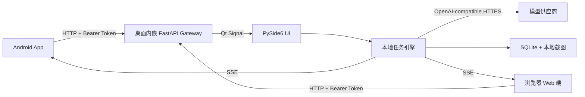

# 架构说明

Screen Assistant 不依赖公网业务服务器。Windows/Linux 桌面程序同时承担截图、模型请求、本地历史和局域网网关职责，Android App 和浏览器 Web 端是已配对的遥控、配置和结果终端。

浏览器端无需额外部署，直接访问桌面网关的 `/` 或 `/web` 页面；具体配对和操作流程见 [Web 端说明](web.md)。

## 安全边界

- API Key 只存在桌面端 `config.json` 和电脑到供应商的请求中。
- App 不接收截图和已有 API Key；模型地址、非敏感模型设置和提示词可由已配对 App 读取并修改。
- mDNS 使用 `_screenasst._tcp.local`，广播只包含电脑 ID、协议版本、地址和端口。
- 配对码有效期两分钟且使用一次后立即失效；每部 App 使用独立 Token，可在桌面端撤销。
- 局域网链路使用 HTTP，适用于用户指定的可信内网场景。

## 并发模型

- AI 任务单并发执行。
- 切换配置等轻量命令通过 Qt 事件队列串行处理；App 翻页和字体命令由电脑事件中心广播，只有当前停留在结果页的在线 App 响应，不注入电脑键鼠事件。
- 截图、提交和清空缓冲为冲突命令；已有任务或待处理命令时返回 `409 busy`。
- 所有已配对 App 订阅同一个事件中心，并在断线后通过 bootstrap 获取完整快照。
